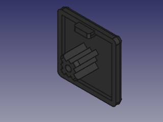

# FreeCAD Parts Library
This is a library of mechanical parts modeled using FreeCAD and other FreeCAD
related assets like macros and templates. The parts library focuses on aluminium
slot profiles and related accessories.

## Compatibility
Prerelease builds of FreeCAD have been used to create the models. Therefore,
incompatibilities with older or newer FreeCAD builds might occur. The following
software builds haven been used and are known to be compatible:
 - [FreeCAD v0.19.20514](https://www.freecadweb.org/downloads.php)
 - [Assembly4 Workbench v0.9.0](https://github.com/Zolko-123/FreeCAD_Assembly4)
 
## Macros
### list-parts
This macro creates spreadsheats of all parts used in an assembly4 model. No gui.
Execute this macro while a document containing an assembly4 model is open. Two
spreadsheets named `parts` and `parts_subassemblies` are created or updated.
 - `parts`: List of all parts used by the root assembly or any referenced child
   assembly.
 - `parts`: List of all parts and subassemblies used by the root assembly.
   Subassemblies are treated as a single part.

The following information (columns) are available in the spreadsheets:
 - `Quantity`
 - `Type` - Value of property `[Tt]ype`. If such a property dues not exist, the value of the property `[Ll]abel` is used instead. Some parts are treated specially: assembly4 models will use the name of the containing document, if the default label has not been changed; features created with the fasteners workbench are named appropriately.
 - `Label` - Value of property `[Ll]abel2`. In case of features created with the fasteners workbench, the diameter and length of the screw are used instead.
 - `Assembly` - Containing assembly or subassembly.
 - `Document` - Containing document.
 - `Description` - Value of property `[Dd]escription`

Column width must be adjusted manually. Width is preserved when the spreadsheets
are updated.

## Templates
### TechDraw: A4_Landscape.svg
Simple document frame to be used as template for the TechDraw workbench.

## Parts
### AP3030S8
Aluminium slot profile (30mm x 30mm, slot 8mm, B-Type) and related accessories.

|  |  |  |
|:---:|:---:|:---:|
| [**AP3030S8**   ](AP3030S8.FCStd) | [**AP3030S8_AngleConnector45**   ](AP3030S8_AngleConnector45.FCStd) | [**AP3030S8_BracketSmall**   ](AP3030S8_BracketSmall.FCStd) |
| [**AP3030S8_BracketSmall_With_Single_StoneM6Heavy**   ](AP3030S8_BracketSmall_With_Single_StoneM6Heavy.FCStd) | [**AP3030S8_BracketSmall_With_Two_StoneM6Heavy**   ](AP3030S8_BracketSmall_With_Two_StoneM6Heavy.FCStd) | [**AP3030S8_Cap**   ](AP3030S8_Cap.FCStd) |
| [**AP3030S8_ConnectorSquare**   ](AP3030S8_ConnectorSquare.FCStd) | [**AP3030S8_InnerBracket**   ](AP3030S8_InnerBracket.FCStd) | [**AP3030S8_InnerBracketWithScrews**   ](AP3030S8_InnerBracketWithScrews.FCStd) |
| [**AP3030S8_StoneM6Heavy**   ](AP3030S8_StoneM6Heavy.FCStd) | [**AP3030S8_StoneM8Heavy**   ](AP3030S8_StoneM8Heavy.FCStd) | |

### Misc
[**ISO4029_SetScrewCupPoint**   ](ISO4029_SetScrewCupPoint.FCStd)